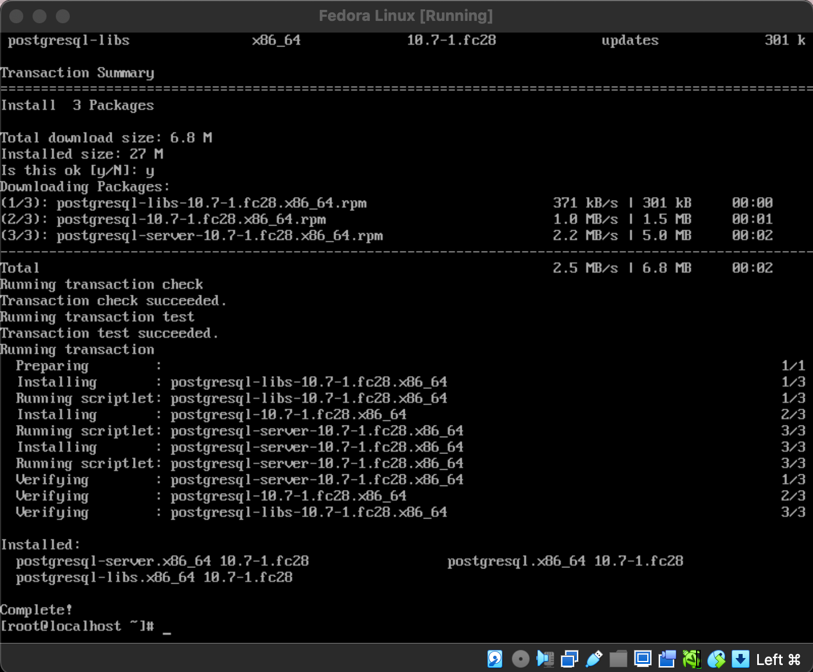
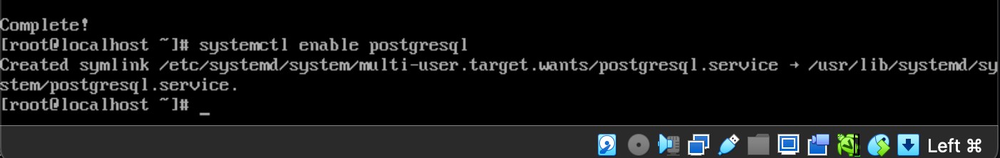
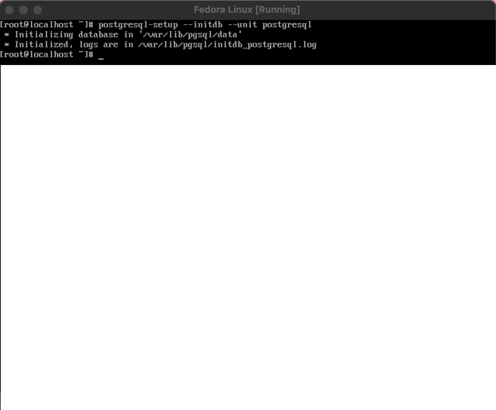
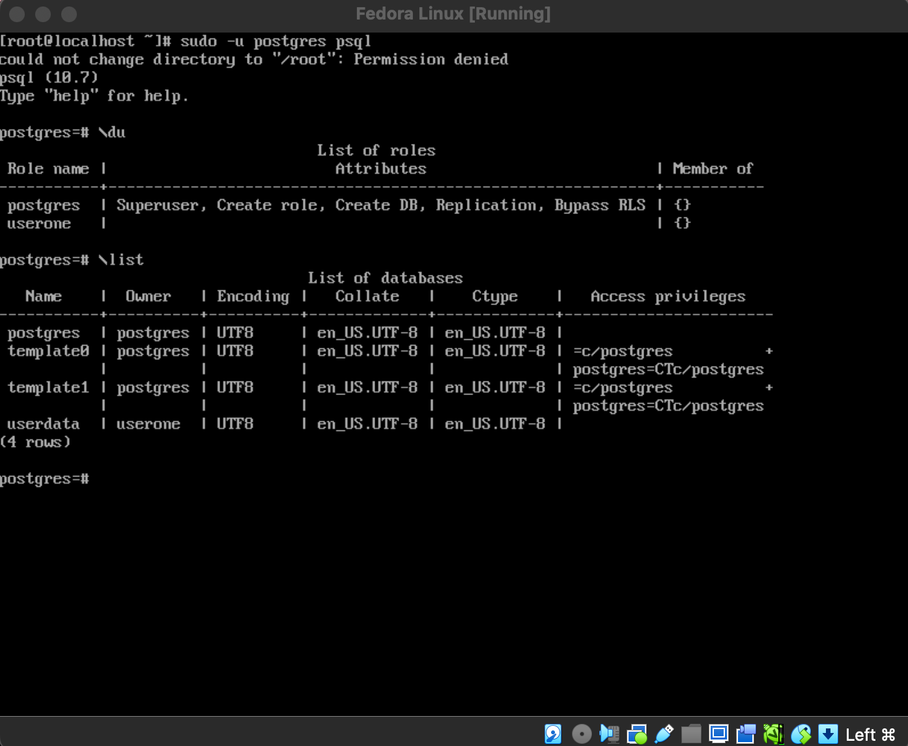
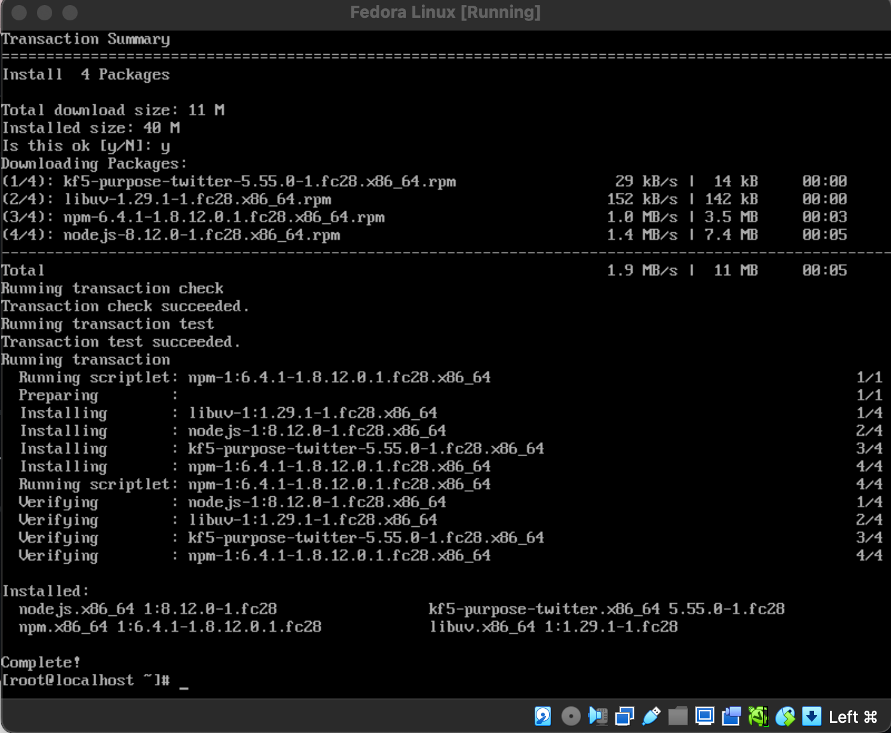
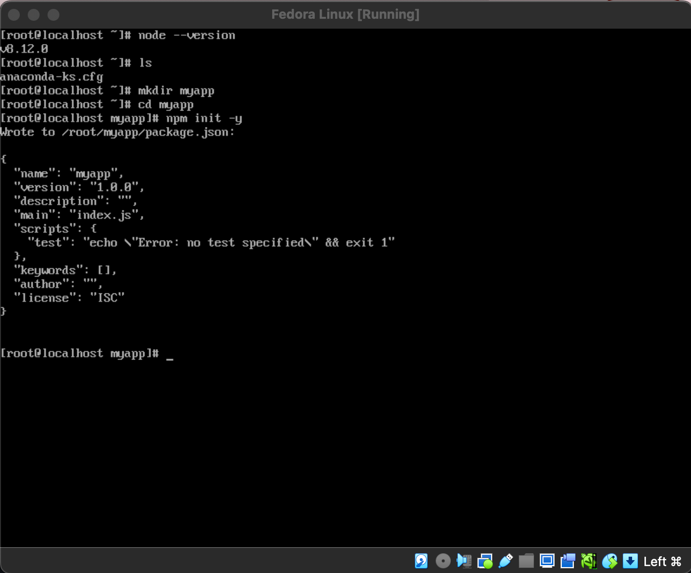
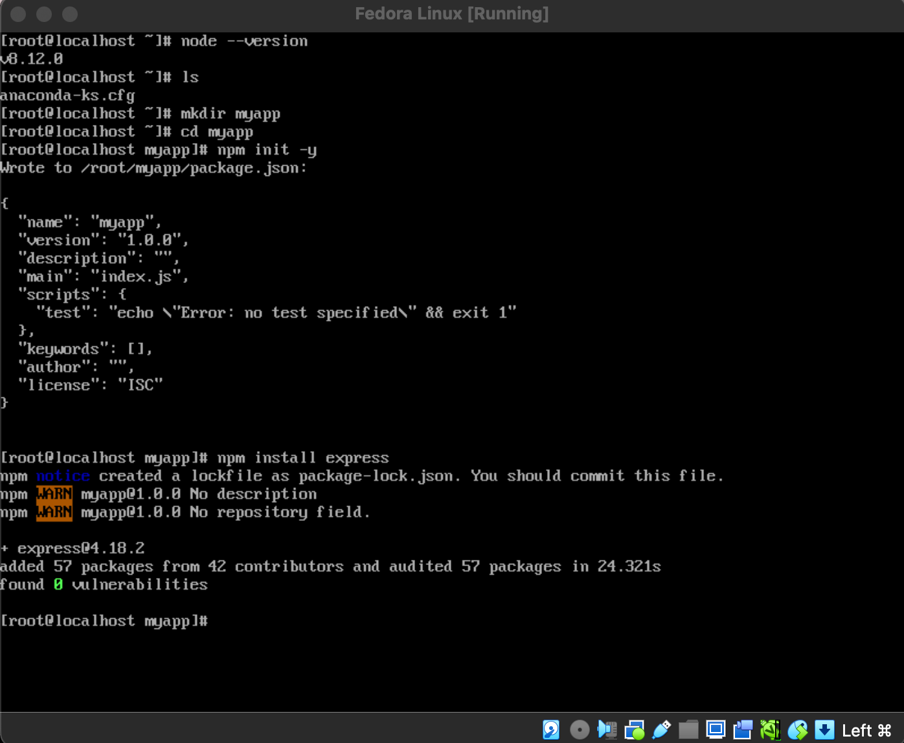
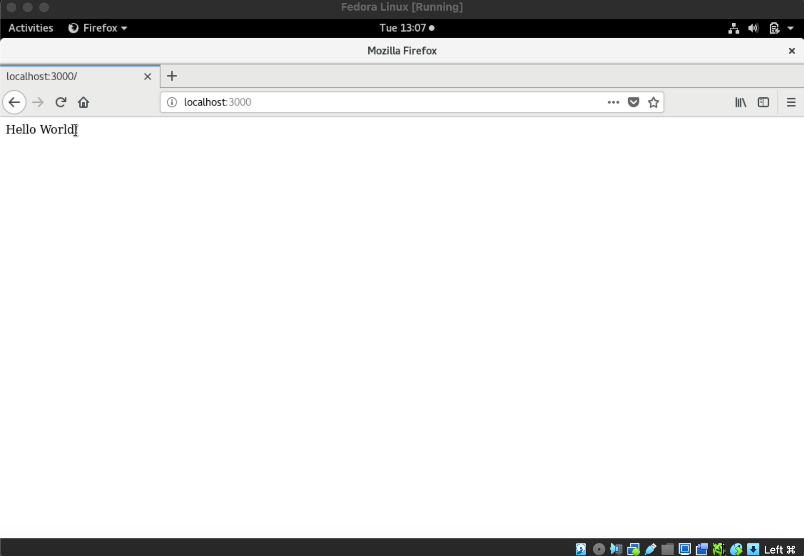

### CIT 352 FINAL PROJECT

**Demonstration on How to Set Up a PERN Stack that can be Used as a Web Server**

PERN stands for PostgreSQL, Express, React and Node.js. 

**PERN Requirements**
- PostgreSQL must be installed and start on boot of the OS
- Node.js must be installed and start on boot of the OS
- Express must be installed and serve a basic web page
- React is optional, but can be considered a stretch challenge
- The web server and PostgreSQL must start automatically when the OS starts

**STEP 1**: Install Postgresql
Run the command lines for proper installation of the program
```
dnf install postgresql-server
```


**Step 2**: Set PostgreSQL to Start at Boot Time
```
systmectl enable postgresql
```


Step 3: Initialize the Database

```
postgresql-setup --initdb --unit postgresql
```



Step 4: Reboot System or Start PostgreSQL Manually Using:

```
systemctl start postgresql
```
Step 5: Create a PostgreSQL User and Database

```
sudo -u postgres psql
```
After running the command above, you are in the postgresql command prompt. You can create a user and database from here with these commands:

```
CREATE USER <username> WITH PASSWORD '<password>';
CREATE DATABASE <databaseName> OWNER <username>;
```
Remember your username, password and databaseName for your database, they are important and will be used later in this turtorial.

Use "\du" to list all roles and "\list" to list all databases to make sure that your database and user were added.

```
\du
\list
```
Step 6: Exit the Terminal

```
\q
```


You can now access you user's database at any time with this command:

```
psql <databaseName>
```
**Node.js Installation**

Step 1: Install Node.js Using dnf and Enter "Y" when Prompted

```
dnf install nodejs
```


Express Installation/Web Server Setup
*Follow these insctructions in the command line of your Fedora Linux machine to install and set up a basic web server using express:*

Step 1: Create and Move Into a Directory for your project


```
mkdir <projectname>
cd <projectname>
```

Step 2: Create a package.json file.

```
npm init -y
```


Step 3: Install Express

```
npm install express
```


Step 4: Create a js file and add code. In this turtorial, I will be using vim, but use whatever text editing software you are comfortable with.

```
vi app.js
```
You will use the express module and also the body-parser module. You also want to set your port variable so that you know where to look for your web server. Now copy the code below into your app.js file.

```
const express = require('express');
const bodyParser = require('body-parser');
const port = 3000;

const app = express();
app.use(bodyParser.json());
app.use(
  bodyParser.urlencoded({
    extended: true,
  })
);
```

Step 7: Open your browser and in the search bar type "http://localhost:3000" and hit enter. This is what you should see in you browser:


